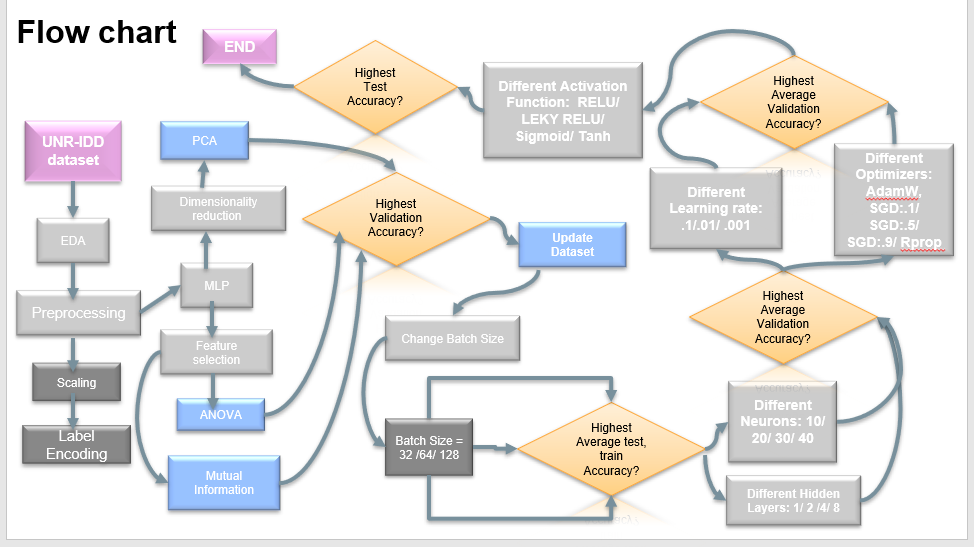

<h1>overview</h1>
<pr>
With the expanded applications of modern-day networking, network infrastructures are at risk from cyber-attacks and intrusions.
Multiple datasets have been proposed in the literature that can be used to create Machine Learning (ML) based Network Intrusion Detection Systems (NIDS). 
However, many of these datasets suffer from sub-optimal performance and do not adequately and effectively represent all types of intrusions. 
Another problem with these datasets is the low accuracy of tail classes. 
To address these issues, the University of Nevada - Reno proposed an Intrusion Detection Dataset (UNR-IDD) that provides researchers with a wider range of samples and scenarios.
</pr> 

<h2>Problem flowchart</h2>

  

<h2>I use different techniques through project that help to apply what we learn theoretically:</h2>
<ol>
<li>
Exploratory Data Analysis,
<li>
Build abase line model with one hidden layer,
<li>
Make feature engineering to see the best result of applying,
<li>
Dimensionality Reduction method or Feature Selection ( Anova and Mutual Information )
<li>
Choose ANOVA according to best validation .
</ol>

Then we try to different hyperparameters of Basemodel
<ol>
<li>
Trying different batch size( 32,64,128). 
We notice that as batch size increases time of running decreases and accuracy of testing and validation increases.
<li>
Hidden layers vs neurons 
we notice that as mush number of layers increases, time of computation increase and model become more complex accuracy also increases.
<li>
Different Learning rate and different optimizers.
<li>
Different activation function and see impact of each of them in one problem
</ol>

